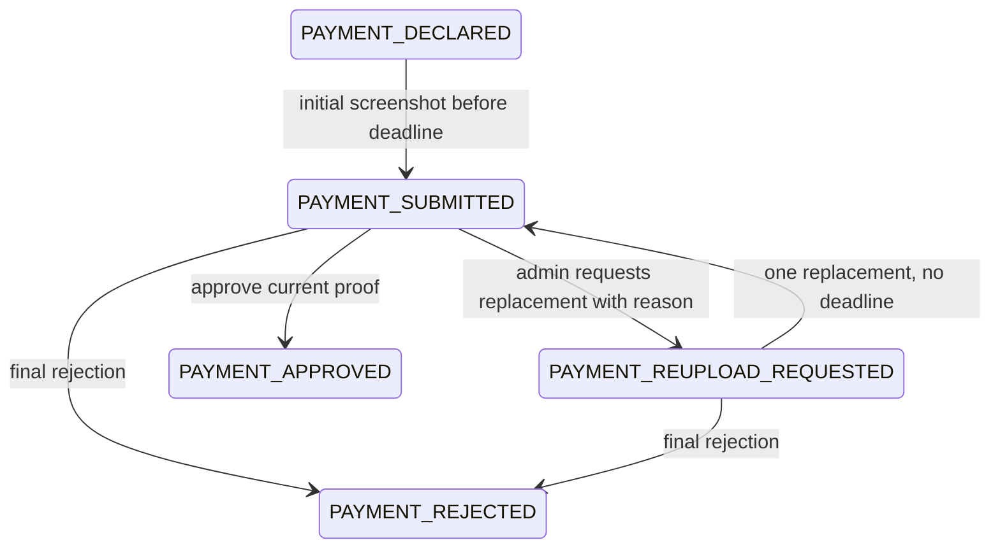

# R2 uploads, event gallery, and payment replacements

Implementation branch: `codex/r2-media-and-gallery`. Backend scope agreed on 2026-09-03.

## Agreed behavior

- JPEG, PNG, and WebP; maximum 7 MB per file (implemented as 7,340,032 bytes).
- One image per snap and one screenshot per payment submission.
- Image bytes are decoded, validated, and re-encoded; GPS/EXIF metadata is removed. Single-frame images only, with a 40-megapixel decoding ceiling.
- Payment screenshots are private to the order owner and authenticated administrators.
- Submitted proofs are locked. An admin must explicitly request another upload and supply a reason.
- Each request grants exactly one replacement upload. Replacements have no deadline; submitting one locks the proof again.
- Earlier proofs and review reasons remain available privately as history.
- Food remains reserved during review and while a replacement is requested. Approval alone changes reserved quantities to sold. Final rejection releases stock.
- The initial payment declaration/proof deadlines still apply to the first screenshot.
- Any logged-in user may post one snap per event. At least one approved order for that event increases the allowance to two total.
- Multiple approved orders do not increase the two-photo cap.
- Administrators configure the snap opening and closing timestamps. Opening is inclusive; closing is exclusive.
- The frontend displays Myanmar time, using `Asia/Yangon`; send timestamps with `+06:30` or `Z`. MongoDB stores instants in UTC.
- Snaps appear immediately in a public gallery with the current account name and an optional caption of up to 300 characters.
- Reactions require login. One LIKE or DISLIKE per account/photo; switching replaces it and sending null removes it.
- Owners may delete and replace snaps during the open window. Owner deletion frees a slot.
- Admin removal is allowed regardless of the window and permanently consumes that event's slot.
- Gallery viewing and reactions remain available after the upload window closes.

## Architecture

The frontend sends multipart files to Express. The server authenticates the caller, validates and sanitizes the image, and uploads bytes using R2's S3 API. The bucket remains private. Public gallery image requests pass through the API; payment image requests additionally verify ownership/admin role.

R2 is accessed through the AWS SDK v3 using the account endpoint and `auto` region, following [Cloudflare's SDK example](https://developers.cloudflare.com/r2/examples/aws/aws-sdk-js-v3/). Runtime storage access needs bucket-scoped object permissions; see [R2 authentication](https://developers.cloudflare.com/r2/api/tokens/).

No credentials, public proof URLs, or client-chosen storage keys are accepted through upload endpoints. Private images must be fetched with the bearer token and displayed as browser blob URLs; a normal image tag cannot supply that header.

### MongoDB requirements

A replica set or sharded cluster is required for transactions. Atlas or a local single-node replica set is suitable. The server checks this on startup and creates the required indexes before listening. See [MongoDB transactions](https://www.mongodb.com/docs/manual/core/transactions/).

Proof submission atomically updates the order, payment history, and asset attachment. Admin review atomically changes inventory, order/payment states, ticket, and notification. Photo creation atomically attaches the image and claims a uniquely indexed slot. Reactions serialize with removal, and a unique index prevents multiple reactions by one account.

Existing order creation, declaration, cancellation, and expiry services still use their original conditional updates and compensation. This feature does not make those older multi-document operations transaction-safe.

### R2/database cleanup

R2 writes cannot participate in a MongoDB transaction. An asset is recorded as STAGED before upload and marked ATTACHED only when the corresponding database transaction commits.

Failed uploads/attachments become DELETE_PENDING. Owner/admin deletion hides the photo immediately and transactionally queues its object for deletion. The server retries cleanup every minute in batches of 100. A one-hour-old unattached asset is also queued, covering process crashes. `npm run media:cleanup` runs a manual pass.

Removed content returns 404 through the API immediately, even if R2 deletion is delayed. Image responses use no-store. Previously downloaded copies cannot be recalled. Payment history assets remain attached; automatic historical-proof retention limits are not part of this version.

## API contract

All protected calls use `Authorization: Bearer <JWT>`. Error envelopes are `{ "error": { "message": "..." } }`.

### Payment endpoints

| Method | Route | Access | Purpose |
| --- | --- | --- | --- |
| POST | /api/payments/orders/:orderId | Owner | Initial proof or granted replacement; multipart field image |
| GET | /api/payments/orders/:orderId | Owner | Status, current version, replacement reason, proof links, review history |
| GET | /api/payments/:id/proofs/:version | Owner/admin | Stream a private historical or current screenshot |
| GET | /api/admin/payments | Admin | Submitted and replacement-requested payments |
| PATCH | /api/admin/payments/:id/review | Admin | Approve, request replacement, or finally reject |

Review bodies:

```json
{ "decision": "APPROVED", "proofVersion": 1 }
```

```json
{ "decision": "REUPLOAD_REQUESTED", "proofVersion": 1, "reason": "The receipt amount is unreadable. Please upload a clear screenshot." }
```

```json
{ "decision": "REJECTED", "proofVersion": 1, "reason": "The payment could not be verified." }
```

`proofVersion` is required by the HTTP API; reload if a stale review receives 409. A reason (maximum 500 characters) is mandatory for requests and rejections. `rejectionReason` is accepted as a compatibility alias. A final rejection may also close an outstanding replacement request.

The response contains `order`, `payment`, and a ticket after approval. A payment includes:

```json
{
  "id": "payment-id",
  "orderId": "order-id",
  "status": "REUPLOAD_REQUESTED",
  "proofVersion": 1,
  "canReupload": true,
  "reuploadReason": "The receipt amount is unreadable.",
  "proofs": [
    { "version": 1, "submittedAt": "2030-01-01T03:00:00.000Z", "imageUrl": "/api/payments/payment-id/proofs/1" }
  ],
  "reviewHistory": []
}
```

The sample omits other response fields. Review history contains actual decisions, reasons, proof versions, reviewer IDs, and timestamps.

### Payment lifecycle



The order status `PAYMENT_REUPLOAD_REQUESTED` corresponds to payment status `REUPLOAD_REQUESTED`. Both submitted and replacement-requested orders remain RESERVED and are excluded from expiry cleanup. Notification type `PAYMENT_REUPLOAD_REQUESTED` supplies the latest required reason; full history is in Payment.

### Snap endpoints

| Method | Route | Access | Purpose |
| --- | --- | --- | --- |
| GET | /api/memories | Public | Current-event gallery; limit 1–50 (default 20), optional before cursor |
| GET | /api/memories/window | Public | Window, eventId, timeZone, status |
| GET | /api/memories/allowance | Logged in | Window plus allowance, used, remaining |
| GET | /api/memories/mine | Logged in | Own active/moderated photos and statuses |
| POST | /api/memories | Logged in | Multipart image and optional caption |
| GET | /api/memories/:id/image | Public | Active snap bytes |
| DELETE | /api/memories/:id | Owner | Delete within window; free slot |
| GET | /api/memories/:id/reaction | Logged in | Current account's reaction or null |
| PUT | /api/memories/:id/reaction | Logged in | Set LIKE, DISLIKE, or null |
| GET | /api/admin/memories/window | Admin | Read current configuration |
| PUT | /api/admin/memories/window | Admin | Set opening/closing instants |
| DELETE | /api/admin/memories/:id | Admin | Remove photo and retain occupied slot |

Window request:

```json
{
  "opensAt": "2030-01-01T09:00:00+06:30",
  "closesAt": "2030-01-02T18:00:00+06:30"
}
```

Reaction request: `{ "reaction": "LIKE" }`, `{ "reaction": "DISLIKE" }`, or `{ "reaction": null }`. Setting the same reaction is idempotent. The frontend implements toggle-off by sending null.

Gallery items contain `id`, `accountName`, `caption`, `imageUrl`, `createdAt`, `likes`, and `dislikes`. The response also contains `nextCursor`; pass it as `before` for the next page.

Typical errors: 400 invalid file/body/date, 401 no login, 403 not admin, 404 missing/not-owned object, 409 quota/window/locked proof/stale version, 410 initial proof deadline expired, 413 file too large, 502 storage unavailable, 503 R2 or current event not configured.

### Frontend upload example

```js
const body = new FormData();
body.append('image', selectedFile);
body.append('caption', caption); // snaps only
const response = await fetch(API_BASE + '/api/memories', {
  method: 'POST',
  headers: { Authorization: 'Bearer ' + token },
  body,
});
// Let the browser set Content-Type including the multipart boundary.
```

Use the same image field with the payment upload route. Resolve returned relative image URLs against the API origin. Render account names, captions, and reasons as text, not HTML.

## Cloudflare R2 setup

1. Enable R2 in the team's Cloudflare account.
2. Create a private bucket (suggested name: funfair-media). Keep r2.dev public access and custom domains disabled.
3. Create an R2 token with Object Read & Write permission scoped to this bucket.
4. Copy server/.env.example to server/.env and set R2_ACCOUNT_ID, R2_ACCESS_KEY_ID, R2_SECRET_ACCESS_KEY, and R2_BUCKET.
5. Set JWT_SECRET and a transaction-capable MONGODB_URI. Never commit .env or put R2 credentials in frontend variables.
6. Alternatively, use `npm run r2:setup` with temporary bucket-creation-capable credentials to create the bucket. Afterwards replace them with the scoped runtime credentials. The script uses supported [HeadBucket/CreateBucket operations](https://developers.cloudflare.com/r2/api/s3/api/).
7. Run the backend, upload a snap and a payment proof, verify anonymous proof access is rejected, then remove the snap and verify its R2 object is cleaned up.

Browsers upload to Express, so R2 browser CORS is unnecessary for this implementation. Configure CLIENT_URL for the actual frontend origin.

## Existing data and team handoff

- New orders store eventId. Approved legacy orders without eventId do not automatically qualify for a second photo.
- Run `npm run migrate:media` for a read-only report. If all legacy orders belong to the current event, `npm run migrate:media -- --apply` backfills their eventId.
- The migration refuses to proceed if URL-only legacy memories exist. These require deliberate R2 import, asset linkage, event assignment, and slot assignment; the tool does not download arbitrary legacy URLs or discard photos.
- Legacy paymentProof references remain in the schema for compatibility. Only screenshots uploaded through the new API have private versioned image routes.
- The project still has one current EventConfig singleton. Do not repurpose its ID for another fair; a future multi-event rollover must preserve event identity and history.
- Shared changes: Order.eventId and new status, Payment proof/review history, transactional paymentService, inventory settlement helper, and database startup requirements.
- The media developer owns these admin endpoints. The admin teammate owns the screens that consume them.
- Upload APIs now require actual multipart files; old JSON-only URL submissions are intentionally rejected.
- Admin review callers must send proofVersion. Status lists, filters, and dashboards should include replacement-requested orders separately from submitted proofs.
- No frontend, payment gateway, refunds, or notifications outside MongoDB are included. Bucket provisioning is supplied as a setup script; Cloudflare account access and credentials are still needed for the live setup.

## Verification

`npm test` creates an isolated temporary MongoDB replica set and runs the existing tests plus media integration tests. It does not connect to the application database. The first run downloads MongoDB into the ignored .mongodb-binaries directory.

Integration tests exercise HTTP authorization, validation, window limits, quota concurrency, reaction uniqueness, deletion, payment privacy, replacement history/concurrency, stale review rejection, inventory settlement/rollback, and retryable object cleanup. R2 object operations are replaced by an in-memory adapter; the live R2 smoke test remains a separate deployment check.

Verified on 2026-09-03: **84 tests passed, 0 failed**, using Node.js 24.11.1 and an isolated MongoDB 8.2.6 replica set. Live Cloudflare credentials were unavailable, so bucket creation and live R2 upload/download/deletion have not been executed.
